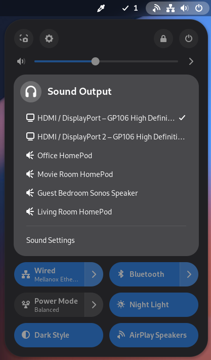
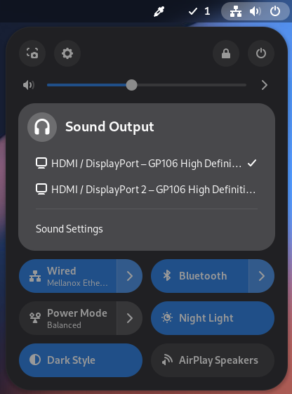
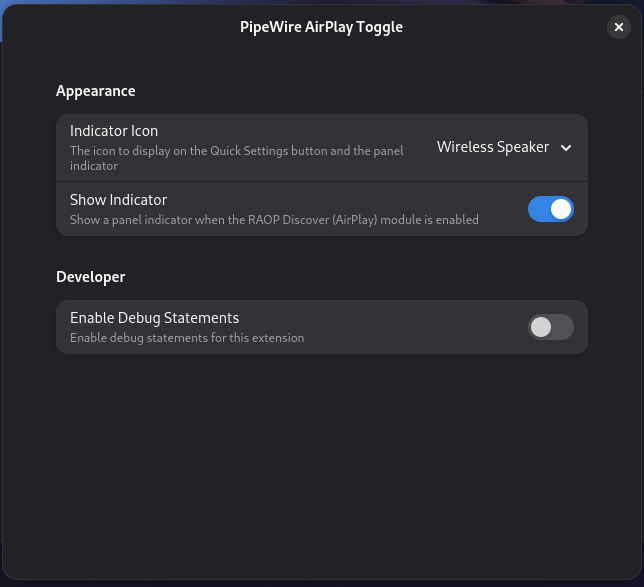

# pipewire-airplay-toggle

This is a simple Gnome-Shell extension to load and unload the 'module-raop-discover' module in PipeWire (or PulseAudio starting with version 7 of the extension). The result of this action allows users to toggle AirPlay® speaker connectivity on and off with the click of a button.

To use this extension, you must be using GNOME 45 or later and PipeWire (or PulseAudio starting with version 7), along with other dependencies.

More details, including installation and usage guides, can be found on the [Wiki](https://github.com/craw0967/pipewire-airplay-toggle/wiki)

Note: Basic PulseAudio support has been added because it was relatively straightforward to do. The focus of this project however is still PipeWire, and future versions may include updates that rely on PipeWire specific features.

AirPlay® is a trademark of Apple Inc., registered in the U.S. and other countries and regions.

  
Toggled On | Toggled Off
:-------------------------:|:-------------------------:
  |  

Settings
:-------------------------:
 |

