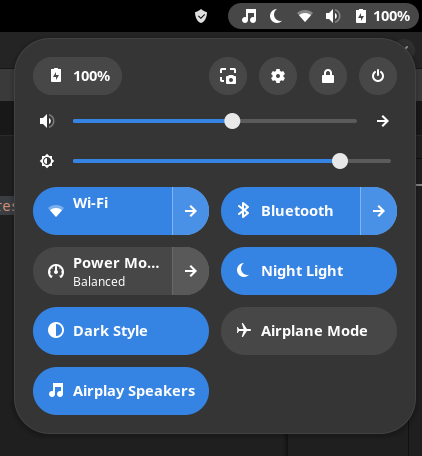

# pipewire-airplay-toggle

Simple Gnome-Shell extension to load and unload the 'module-raop-discover' Pipewire module to toggle AirPlay speaker connectivity.

You must be on Gnome 45 or later for this extension. Pipewire and pipewire-zeroconf must be installed. This extension does not currently support Pulseaudio.

  

## To Install ##
Recommended:

[Install via the official Gnome Extensions website](https://extensions.gnome.org/extension/7652/pipewire-airplay-toggle/)

Manually:

Copy the `pipewire-airplay-toggle@craw0967.github.com` folder to your `~/.local/share/gnome-shell/extensions/` directory to install for the current user, or to the `/usr/share/gnome-shell/extensions/` directory to install for all users.

Enable the extension in the GNOME Extensions manager. Rebooting may be required.
